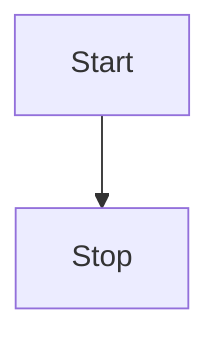
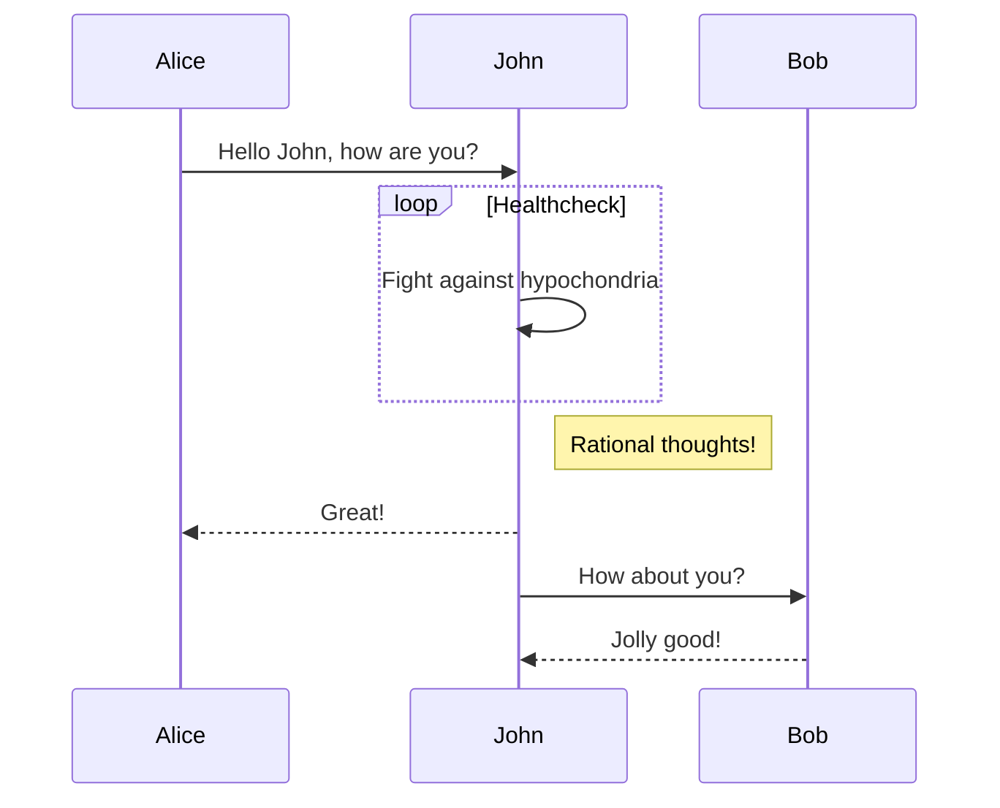
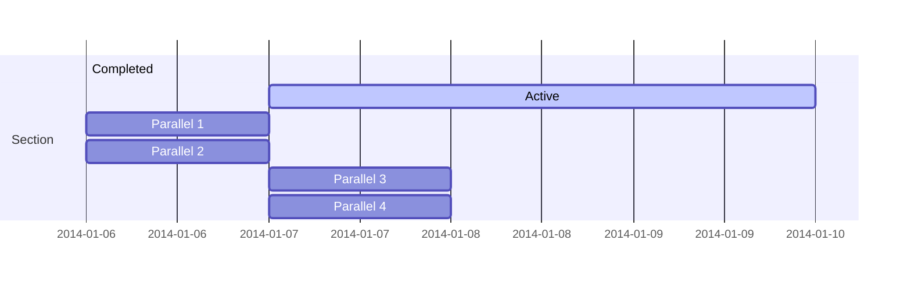

# 组件配置

## tabs

- Type: `boolean`

支持局部的`tabs`面板

效果如下

:::=tabs
::tab1
一些内容

一些内容

一些内容

::tab2
一些内容 。。。
:::

:::warning 一点说明

基于 [vitepress-plugin-tabs](https://www.npmjs.com/package/vitepress-plugin-tabs) 重新打包实现

由于原包是 esm 产物，部分项目 无法直接使用，固主题进行内置进行了重新打包
:::

开启方式如下
:::code-group

```sh [① 安装依赖]
pnpm add vitepress-plugin-tabs@0.2.0
```

```ts [② 引入组件]
// .vitepress/theme/index.ts
import BlogTheme from '小小荧'
import { enhanceAppWithTabs } from 'vitepress-plugin-tabs/client'

export default {
  ...BlogTheme,
  enhanceApp(ctx: any) {
    enhanceAppWithTabs(ctx.app)
  }
}
```

```ts [③ 开启支持]
// .vitepress/config.ts
const blogTheme = getThemeConfig({
  tabs: true
})
```

```ts [④ 预构建排除依赖]
// .vitepress/config.ts
const blogTheme = getThemeConfig({
  tabs: true
})

export default defineConfig({
  extends: blogTheme,
  vite: {
    optimizeDeps: {
      exclude: ['vitepress-plugin-tabs']
    }
  }
})
```

:::

简单的使用方式如下

```md
:::=tabs
::tab1
一些内容

一些内容

一些内容

::tab2
一些内容 。。。
:::
```

共享状态的使用方式如下

```md
:::=tabs=ab
::a
a content

::b
b content
:::

:::=tabs=ab
::a
a content 2

::b
b content 2
:::
```

:::=tabs=ab
::a
a content

::b
b content
:::

:::=tabs=ab
::a
a content 2

::b
b content 2
:::

## UserWorksPage

- Type: `UserWorks`

用于作品列表展示

效果如下，详见 [个人作品展示](./../work.md)


新建一个`works.md`文件，放入以下内容

```md
---
layout: page
title: 个人作品展示
sidebar: false
outline: [2, 3]
sticky: 1
---

<UserWorksPage />
```

内容配置方式如下

::: code-group

```ts [default]
const blogTheme = getThemeConfig({
  works: {
    title: '个人项目/线上作品',
    description: '记录开发的点点滴滴',
    topTitle: '举些🌰',
    list: [
      {
        title: '博客主题 小小荧',
        description: '基于 vitepress 实现的博客主题',
        time: {
          start: '2023/01/29'
        },
        github: {
          owner: 'xfy196',
          repo: 'blog',
          branch: 'master',
          path: 'packages/theme'
        },
        status: {
          text: '自定义badge'
        },
        url: 'https://theme.sugarat.top',
        cover:
          'https://img.cdn.sugarat.top/mdImg/MTY3MzE3MDUxOTMwMw==673170519303',
        tags: ['Vitepress', 'Vue'],
        links: [
          {
            title: '一个简约风的VitePress博客主题',
            url: 'https://juejin.cn/post/7196517835380293693'
          }
        ]
      }
    ]
  }
})
```

```ts [type]
interface UserWorks {
  title: string
  description?: string
  topTitle?: string
  list: UserWork[]
}
interface UserWork {
  title: string
  description: string
  time:
    | string
    | {
        start: string
        end?: string
        lastupdate?: string
      }
  status?: {
    text: string
    type?: 'tip' | 'warning' | 'danger'
  }
  url?: string
  github?:
    | string
    | {
        owner: string
        repo: string
        branch?: string
        path?: string
      }
  cover?:
    | string
    | string[]
    | {
        urls: string[]
        layout?: 'swiper' | 'list'
      }
  links?: {
    title: string
    url: string
  }[]
  tags?: string[]
  top?: number
}
```

:::

## Mermaid - 图表

- Type: `boolean`|`object`

> 通过解析类 Markdown 的文本语法来实现图表的创建和动态修改。

:::tip 一点说明
基于 [vitepress-plugin-mermaid](https://github.com/emersonbottero/vitepress-plugin-mermaid) 实现
:::

简单语法如下，详细流程图语法见 [Mermaid 中文文档](https://github.com/mermaid-js/mermaid/blob/develop/README.zh-CN.md)

<pre>

</pre>

效果如下


默认开启，可以通过`mermaid`进行进一步配置，或关闭

:::code-group

```ts [① 关闭]
const blogTheme = getThemeConfig({
  mermaid: false
})
```

```ts [② 进一步配置]
const blogTheme = getThemeConfig({
  mermaid: {
    // refer https://mermaid.js.org/config/setup/modules/mermaidAPI.html#mermaidapi-configuration-defaults for options
  }
})
```

:::

下面看一下官方其它案例

**时序图**



**甘特图**


